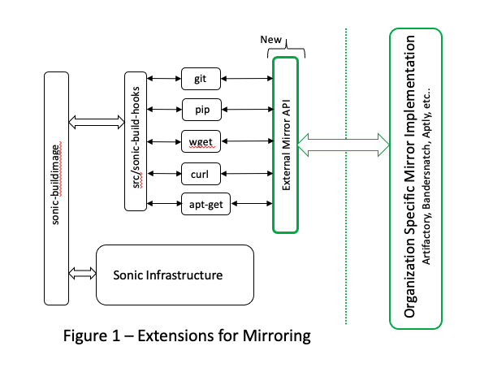

# Table of Contents
<!-- TOC -->
- [Scope](#scope)
  - [Essential Mirroring Concepts](#Essential-Mirroring-Concepts)
- [Mirroring Implementation Overview](#Mirroring-Implementation-Overview)
  - [PIP Specific Mirror Management](#PIP-Specific-Mirror-Management)
  - [Mirroring of go Packages](#Mirroring-of-go-Packages)
<!-- /TOC -->

## Scope

The Sonic community is working on improvements to ensure reproducible
builds. Their approach is rooted in adding hooks to the sub-systems
around operations which use external/upstream components. These hooks
allow package versions to be specified in a file and supplied when
fetching from upstream. These hooks also provide an intercept location
which serves well to install extensions to fetch from local,
organization specific mirror servers. The proposal behind the
community enhancements can be referenced here:

[https://github.com/xumia/SONiC/blob/repd3/doc/sonic-build-system/SONiC-Reproduceable-Build.md](https://github.com/xumia/SONiC/blob/repd3/doc/sonic-build-system/SONiC-Reproduceable-Build.md)

This document outlines a proposal to extend this infrastructure to
provide an API to fetch packages from organization specific mirroring.
The concept is to avoid any specific mirroring strategy, allowing each
organization to implement per what fits their internal storage
capabilities and IT support best. Figure 1 shows how the
proposed extension fits the current model.

## Essential Mirroring Concepts

There are a vast number of open source, best practice oriented approaches to mirroring
packages.  Some examples:

- Aptly or standard Debian Mirroring for Debian.
- Banderstanch and PyPi caching mirrors for PIP and Python.
- Artifactory.
- Simple disk based storage with an HTTP server frontend for packages such as `curl` or `wget`.
- Several options are available for `git` repositories, such as BitBucket or github.
- Proxy servers such as Athens for `go` packages.

The scope of this proposed design is to extend the existing hooks to allow companies and
organizations to provide mirroring as needed. For organizations that are focused on releasing
product around Sonic, there are three primary goals:

1. Complete reproducibility of builds.
2. Ensuring long-term of availability of all packages used in a build.
3. Generation of a Manifest. Generation of a Manifest is outside the scope of this
document and proposal, but it should be noted that the extensions easily allow tracking
of all packages and their origin, opening the door to automated Manifest generation.

Additionally, organizations may work with multiple branches of Sonic simultaneously, such
as 201911 and 202012, and within those, various internal branches and release points.
Each one of these can drive a need to have a package mirror per release to ensure long
term stability and reproducibility. Through the Sonic baseline having package version
specifiers, coupled with the ability to mirror all packages into persistent, long-term
stable storage, complete, long-term reproducibility of any Sonic release is achieved.

# Mirroring Implementation Overview

The core concept of adding mirroring extensions is to be as non-intrusive as possible to
the Sonic infrastructure. Thus, the mirroring extensions should be configurable by end-users.
If the extensions are configured in, they are used. Else, existing build behavior of Sonic
operates with no changes. When configured to be used, the basic principle of operation
shall be as follows:

1. The Sonic hooks call into the mirroring extension. If the mirror is able to satisfy
the request, it does.
2. If the request cannot be satisfied, the existing Sonic implementation is invoked.

The mirroring extensions will be comprised of two primary components:

1. Actual changes to the existing Sonic hooks to allow a mirror to be configured.
2. Example documentation on how to implement a mirror.  Effectively, a Users Guide
with examples.

## PIP Specific Mirror Management

To properly fetch packages from a local PIP mirror, it's necessary to install a
`</etc/pip.conf>` file in the Docker containers. This has been fully tested, and
the proposed approach to this is to update the appropriate `<Dockerfile.j2>` files
to allow them to install a `</etc/pip.conf>` file which points to the local mirror
based on a configuration setting.

## Mirroring of `go` Packages
The current strategy is to implement and utilize and Athens Caching Proxy Server.
The changes appear to be focused on adding environment variables that specify using
fetching from this server. Example implementation and usage will be provided as
part of this effort. Current testing in `<sonic-telemetry>` has indicated that this
approach works.

